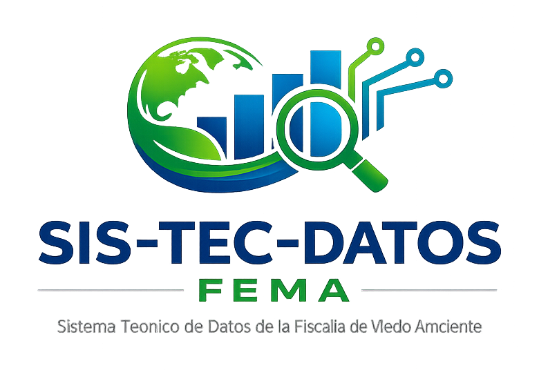

# SIS-TEC-DATOS FEMA

<p align="center">
  
</p>

[](https://opensource.org/licenses/MIT)
[](https://www.python.org/)
[]()

**Sistema Integrado de Gestión y Expedientes de Dictámenes Técnico-Ambientales**

Este proyecto, gestado y desarrollado por **Fernando R. Ardón** para el brazo técnico y ambiental del sector público forestal y judicial, representa una herramienta crucial en el levantamiento, gestión y análisis metódico de evidencia ambiental.

Su arquitectura optimizada en **Python / CustomTkinter / SQLite** permite la autonomía completa del usuario mediante un esquema de entorno local de alta eficiencia y la modularidad suficiente para responder a exigencias forenses avanzadas.

---

## 🚀 Características Open Source

- **Transparencia Completa:** El código ahora es `Open Source` bajo licencia MIT, ideal para otras instituciones ambientales y judiciales que busquen replicar un control hermético de evidencias o dictámenes.
- **Auditoría Forense Integrada:** Tracking estricto sobre cada paso de la vida del expediente (creación, edición, consulta) respaldado nativamente en su sistema criptográfico interno.
- **Offline-First:** Diseñado desde su concepción para operar en tribunales, despachos y locaciones de la fiscalía con restricciones de internet.
- **Modularidad de Múltiple Visión:** Utiliza Toplevels expansivos, un buscador dinámico que acepta queries cruzadas (`Sitios`, `Fiscales`, `Fechas`, `Denuncias`) y exportación condicional a PDF/Excel.

## 🛠️ Requisitos de Entorno

```bash
# Se requiere entorno con Python 3.11+
pip install -r requirements.txt
```

*Nota: Revisa siempre que tu entorno tenga las bibliotecas listadas como CustomTkinter, tkcalendar, reportlab, hashlib, entre otras.*

## 📐 Instalación Local para Desarrollo

1. **Clona el repositorio** o desempaquétalo en tu directorio local.

```bash
git clone https://github.com/tu-usuario/sistecdatos-fema.git
cd sistecdatos-fema
```

1. **Crea y activa tu entorno virtual (Recomendado):**

```bash
python -m venv .venv
# En Windows:
.venv\Scripts\activate
```

1. **Ejecuta el Sistema Localmente:**

```bash
python sistecdatos_main.py
```

## 📚 Documentación Técnica

Toda la estructura técnica profunda, los scripts de generación y un manual extensivo sobre cómo el sistema encripta, genera respaldos horarios (`backups/`) y cómo lidiar con reportaría se encuentran en el archivo original de documentación: **[README_SIGEDTA_v2.md](README_SIGEDTA_v2.md)**

---

## 🤝 Contribuir

Cualquier solicitud que mejore el alcance en justicia ambiental o la velocidad y claridad procesal (UI/UX) es bienvenida a través de `Pull Requests` precisos, comentados en español y guiados bajo el rigor documental característico del proyecto.

## ⚖️ Licencia

Distribuido bajo la Licencia **MIT**. Consulte el archivo `LICENSE` para todos los detalles legales.
